# swift-algorand: high-level design

This document describes how the SDK works from end to end, as of the `0.4.x` line. Every statement
links to the file it comes from. Where the code does not settle a question, the text says
**Unknown:**. The contract this design implements is
[`specs/algorand/algorand.spec.md`](../specs/algorand/algorand.spec.md). If this document and the
spec disagree, the spec wins, and this document needs fixing. What the product should be, in plain
words, is in [`INTENT.md`](../INTENT.md) and [`hi/`](../hi/).

- [1. Purpose](#1-purpose)
- [2. Context](#2-context)
- [3. Components](#3-components)
- [4. Key flows](#4-key-flows)
- [5. Data](#5-data)
- [6. Runtime and deployment](#6-runtime-and-deployment)
- [7. Security and trust boundaries](#7-security-and-trust-boundaries)
- [8. Failure modes and limits](#8-failure-modes-and-limits)
- [9. Decisions](#9-decisions)
- [10. Glossary](#10-glossary)

## 1. Purpose

swift-algorand is a Swift 6 library, `Algorand`, for building on the Algorand blockchain from
Swift apps and services on Apple platforms and Linux. It lets a caller create and restore accounts,
build every transaction type the SDK models (payments, assets, applications, key registration and
atomic groups), price their fees under the consensus v42 usage model, sign them with an in-process
Ed25519 key or with an external signer such as a Falcon-1024 backend, and submit and query them
through async `actor` clients for algod and the indexer. The hard problem it solves is byte
fidelity. A node re-encodes every transaction it receives and checks the signature over its own
encoding, so the SDK has to produce go-algorand's canonical MessagePack exactly, or the signature
fails ([`CanonicalTransactionFields.swift`](../Sources/Algorand/CanonicalTransactionFields.swift)).
The package vends one library product, has no executables, and depends only on `swift-crypto`
([`Package.swift`](../Package.swift)).

## 2. Context

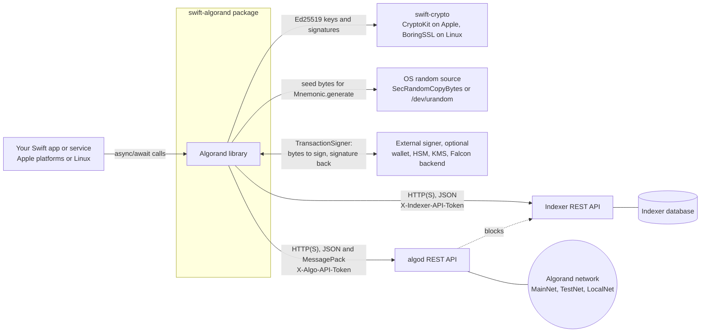

- **Callers** are Swift programs that link the `Algorand` product. The SDK reads no environment
  variables and keeps no files ([`documentation/TESTING.md`](../documentation/TESTING.md)).
- **algod** is the node API. The SDK calls `/v2/status`, `/v2/transactions/params`,
  `/v2/transactions`, `/v2/transactions/pending/{id}`, `/v2/transactions/simulate`,
  `/v2/accounts/...`, `/v2/applications/...` and `/v2/assets/{id}`
  ([`AlgodClient.swift`](../Sources/Algorand/AlgodClient.swift)).
- **The indexer** is the query API. The SDK calls `/health`, `/v2/accounts`, `/v2/transactions`,
  `/v2/assets`, `/v2/applications` and `/v2/blocks/{round}`
  ([`IndexerClient.swift`](../Sources/Algorand/IndexerClient.swift)). The indexer's own database
  and its feed from algod are outside the SDK. The LocalNet stack in
  [`docker-compose.yml`](../docker-compose.yml) shows that shape: algod, indexer and Postgres.
- **Endpoints**: `AlgorandConfiguration` ships the AlgoNode public endpoints for TestNet and
  MainNet and `localhost:4001` / `localhost:8980` for LocalNet. `.custom` takes any URL
  ([`AlgorandConfiguration.swift`](../Sources/Algorand/AlgorandConfiguration.swift)).
- **swift-crypto** provides `Curve25519.Signing` for Ed25519. SHA-512/256 is implemented inside
  the package ([`SHA512_256.swift`](../Sources/Algorand/SHA512_256.swift),
  [`SECURITY.md`](../SECURITY.md)).
- **External signers** plug in through `TransactionSigner`. No Falcon implementation is bundled
  ([`TransactionSigner.swift`](../Sources/Algorand/TransactionSigner.swift)).

## 3. Components

Everything lives in one target, `Sources/Algorand`, with one test target,
`Tests/AlgorandTests` ([`Package.swift`](../Package.swift)). The "components" below are groups
of files inside that target, not separate modules.

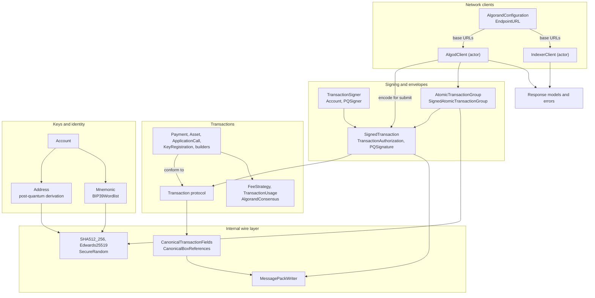

| Component | Files | What it owns |
|---|---|---|
| Keys and identity | [`Account.swift`](../Sources/Algorand/Account.swift), [`Address.swift`](../Sources/Algorand/Address.swift), [`Address+PostQuantum.swift`](../Sources/Algorand/Address+PostQuantum.swift), [`Mnemonic.swift`](../Sources/Algorand/Mnemonic.swift), [`BIP39Wordlist.swift`](../Sources/Algorand/BIP39Wordlist.swift) | Ed25519 key creation and restore, canonical base32 addresses with a 4-byte checksum, strict 25-word mnemonics, and post-quantum address derivation. |
| Amounts | [`MicroAlgos.swift`](../Sources/Algorand/MicroAlgos.swift), [`AmountError.swift`](../Sources/Algorand/AmountError.swift) | `UInt64` microAlgo amounts. The checked forms throw `AmountError`. The operators still trap, and are deprecated. |
| Transactions | [`Transaction.swift`](../Sources/Algorand/Transaction.swift), [`PaymentTransaction.swift`](../Sources/Algorand/PaymentTransaction.swift), [`AssetTransaction.swift`](../Sources/Algorand/AssetTransaction.swift), [`ApplicationTransaction.swift`](../Sources/Algorand/ApplicationTransaction.swift), [`KeyRegistrationTransaction.swift`](../Sources/Algorand/KeyRegistrationTransaction.swift), [`Transaction+Signing.swift`](../Sources/Algorand/Transaction+Signing.swift) | The `Transaction` protocol, the nine concrete transaction structs, their builders and factories, `TransactionParams`, and the signing preimage `bytesToSign(groupID:)`. |
| Fees | [`FeeStrategy.swift`](../Sources/Algorand/FeeStrategy.swift), [`TransactionUsage.swift`](../Sources/Algorand/TransactionUsage.swift), [`AtomicTransactionGroup+Fees.swift`](../Sources/Algorand/AtomicTransactionGroup+Fees.swift), [`AlgorandConsensus.swift`](../Sources/Algorand/AlgorandConsensus.swift), [`FeeError.swift`](../Sources/Algorand/FeeError.swift) | The consensus v42 usage model: per-transaction usage, how a fee is chosen, and the pooled group requirement and check. |
| Signing and envelopes | [`TransactionSigner.swift`](../Sources/Algorand/TransactionSigner.swift), [`TransactionAuthorization.swift`](../Sources/Algorand/TransactionAuthorization.swift), [`SignedTransaction.swift`](../Sources/Algorand/SignedTransaction.swift), [`PQScheme.swift`](../Sources/Algorand/PQScheme.swift), [`PQSignature.swift`](../Sources/Algorand/PQSignature.swift) | The signer seam, the `sig` or `pqsig` proof, when to add `sgnr`, and the `SignedTxn` envelope bytes. |
| Atomic groups | [`AtomicTransactionGroup.swift`](../Sources/Algorand/AtomicTransactionGroup.swift) | Up to 16 ordered members, the group ID, signing each member under it, and joining the envelopes for submission. |
| Internal wire layer | [`CanonicalTransactionFields.swift`](../Sources/Algorand/CanonicalTransactionFields.swift), [`CanonicalBoxReferences.swift`](../Sources/Algorand/CanonicalBoxReferences.swift), [`MessagePackWriter.swift`](../Sources/Algorand/MessagePackWriter.swift), [`SHA512_256.swift`](../Sources/Algorand/SHA512_256.swift), [`Edwards25519.swift`](../Sources/Algorand/Edwards25519.swift), [`SecureRandom.swift`](../Sources/Algorand/SecureRandom.swift) | All `internal`. Omit-empty field rules, box reference translation, a canonical MessagePack writer with no decoder, the hash, the Edwards25519 point check, and CSPRNG bytes. |
| Network clients | [`AlgodClient.swift`](../Sources/Algorand/AlgodClient.swift), [`IndexerClient.swift`](../Sources/Algorand/IndexerClient.swift), [`SimulateRequest+MessagePack.swift`](../Sources/Algorand/SimulateRequest+MessagePack.swift), [`EndpointURL.swift`](../Sources/Algorand/EndpointURL.swift), [`AlgorandConfiguration.swift`](../Sources/Algorand/AlgorandConfiguration.swift) | Two `actor` clients, each with its own `URLSession`. They build requests, check status codes, and decode the `Codable & Sendable` response models declared in the same files. |
| Errors | [`AlgorandError.swift`](../Sources/Algorand/AlgorandError.swift), plus `AmountError`, `FeeError`, `TransactionAuthorizationError` | Typed failures. See [section 8](#8-failure-modes-and-limits). |

### Transaction family

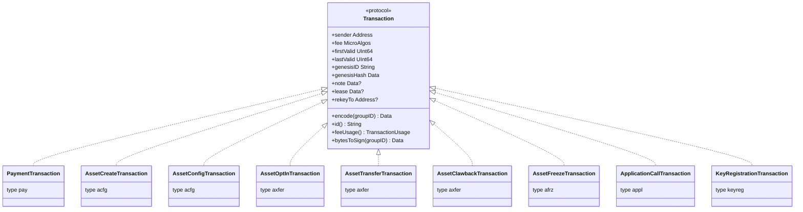

Every type offers two kinds of initializer:

- **Header-field initializers** take `fee`, `firstValid`, `lastValid` and the genesis data
  explicitly. `fee` defaults to `AlgorandConsensus.v42.minimumFee` (1000 microAlgos).
- **Params-based initializers and factories** take `TransactionParams` and a `FeeStrategy`. They
  set the validity window from `params.lastRound` for `validRounds` rounds (default 1000). Then
  they price the fee against a draft of the transaction that carries `min-fee`
  ([`PaymentTransaction.swift`](../Sources/Algorand/PaymentTransaction.swift)).

`PaymentTransactionBuilder` is a value-type builder. Each setter returns a copy, and `build()`
throws `AlgorandError.invalidTransaction` when the sender, receiver, amount or params are missing.
`ApplicationCallTransaction` has factories (`create`, `update`, `delete`, `optIn`, `closeOut`,
`clearState`, `call`), and `KeyRegistrationTransaction` has `online`, `offline` and
`nonparticipating` ([`ApplicationTransaction.swift`](../Sources/Algorand/ApplicationTransaction.swift),
[`KeyRegistrationTransaction.swift`](../Sources/Algorand/KeyRegistrationTransaction.swift)).
A caller can model a transaction type the SDK lacks by conforming to `Transaction` and returning
its own bytes ([`MessagePackWriter.swift`](../Sources/Algorand/MessagePackWriter.swift)).

### Signing model

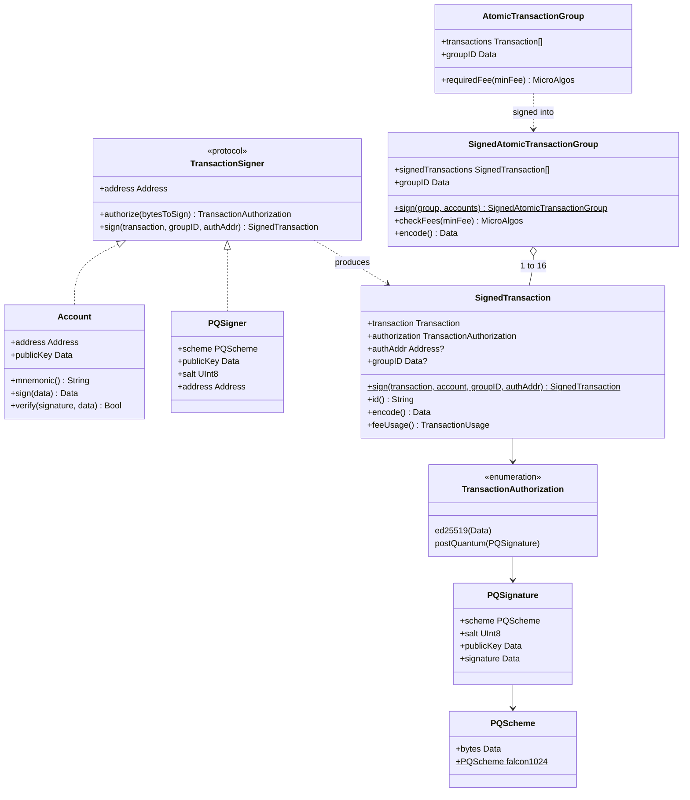

`SignedAtomicTransactionGroup.sign(_:with:)` signs with `[Int: Account]`, so it covers Ed25519
only. To put a `PQSigner` or another `TransactionSigner` in a group, call
`signer.sign(member, groupID: group.groupID)` for each member and assemble
`SignedAtomicTransactionGroup(signedTransactions:groupID:)` yourself
([`AtomicTransactionGroup.swift`](../Sources/Algorand/AtomicTransactionGroup.swift)).

## 4. Key flows

### 4.1 Build, sign and submit a payment

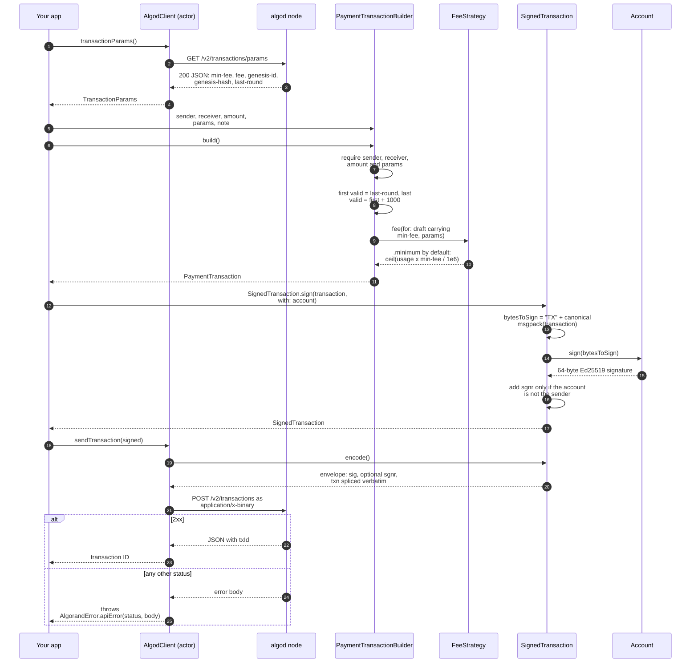

The bytes that are signed and the bytes that are submitted come from the same
`encode(groupID:)` call. The transaction ID is `base32(SHA512/256(bytesToSign))`, so it always
matches the signed bytes ([`SignedTransaction.swift`](../Sources/Algorand/SignedTransaction.swift),
spec invariant 7).

### 4.2 Wait for confirmation

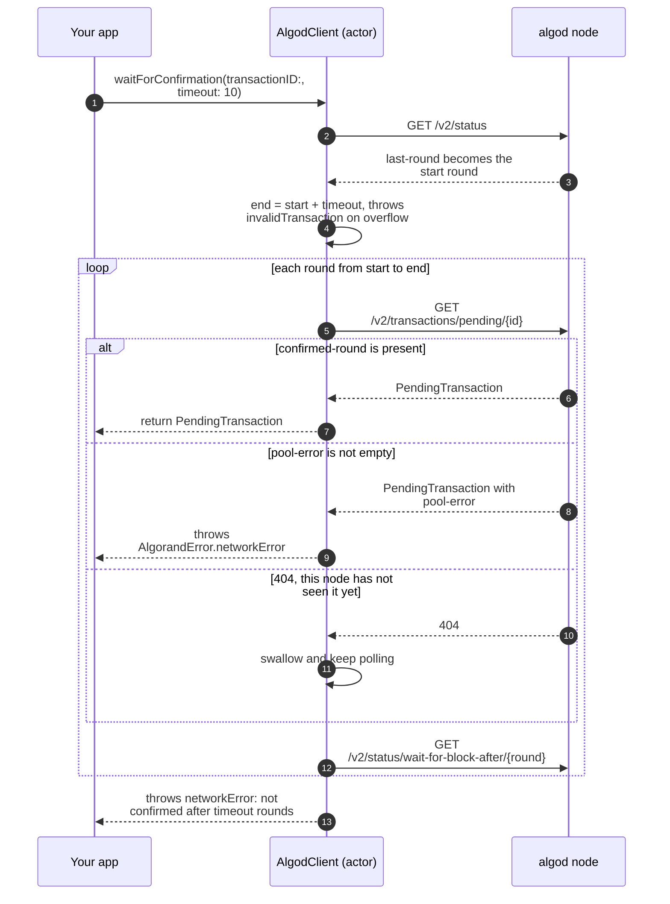

The 404 case matters behind load-balanced public endpoints. There, the node you poll may not be
the node that accepted the submission. Any other status or transport error is rethrown
unchanged ([`AlgodClient.swift`](../Sources/Algorand/AlgodClient.swift), `isNotYetKnown`).

### 4.3 Atomic group with a pooled fee

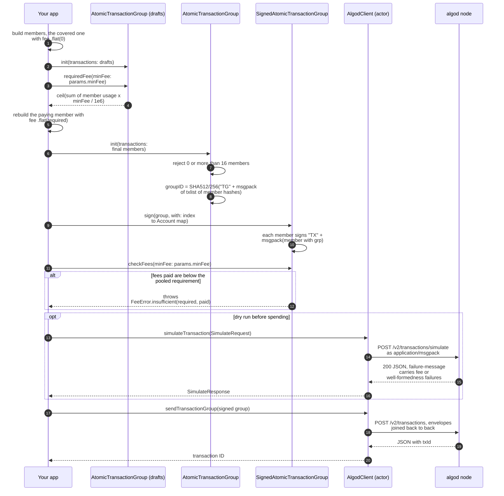

Each member hash is `SHA512/256("TX" + msgpack(member))` taken **without** `grp`. The member
bytes that get signed include `grp`. The fee is part of the signed bytes and of the group ID, so
the fee must be settled before the group ID is computed
([`AtomicTransactionGroup+Fees.swift`](../Sources/Algorand/AtomicTransactionGroup+Fees.swift)).
The simulate body splices each envelope in verbatim through `MessagePackValue.raw`
([`SimulateRequest+MessagePack.swift`](../Sources/Algorand/SimulateRequest+MessagePack.swift)).
A signature failure there comes back as HTTP 400 and throws `apiError`.

### 4.4 Sign for a post-quantum account

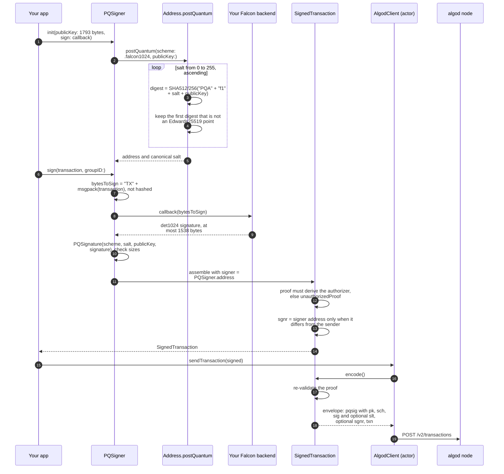

A Falcon-1024 envelope adds two minimum fees of usage (`PQScheme.falcon1024.feeUsage`). Price
the member for it before signing
([`TransactionUsage.swift`](../Sources/Algorand/TransactionUsage.swift),
[`TransactionSigner.swift`](../Sources/Algorand/TransactionSigner.swift)).

### 4.5 Query the indexer

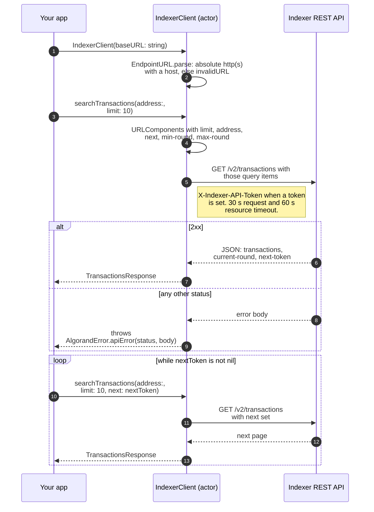

`searchAccounts`, `searchAssets` and `searchApplications` follow the same pattern.
`account`, `transaction`, `asset`, `application`, `block` and `health` are single GETs
([`IndexerClient.swift`](../Sources/Algorand/IndexerClient.swift)).

## 5. Data

The SDK has no database and keeps no state between calls. The only long-lived objects are the
two clients' `URLSession`s and whatever `Account` or `PQSigner` values the caller holds. Its
"data" is three things: wire formats, the fee model, and decoded response models.

### 5.1 Bytes, hashes and identifiers

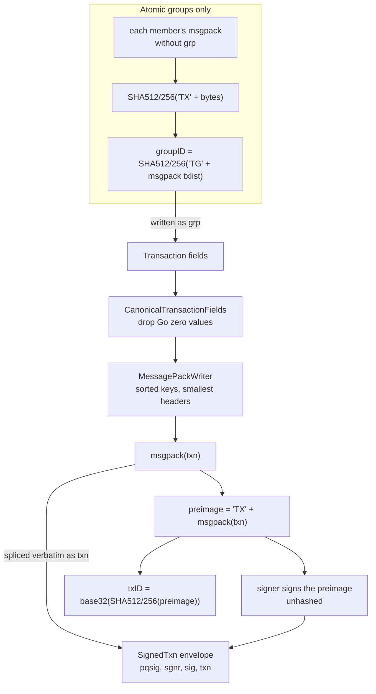

| Rule | Where |
|---|---|
| A field is written only when it differs from its Go zero value: `0`, `false`, `""`, an empty slice, an all-zero fixed array, or the all-zero address. Booleans are MessagePack `true`, never `1`. | [`CanonicalTransactionFields.swift`](../Sources/Algorand/CanonicalTransactionFields.swift) |
| Every type writes the shared header (`type`, `snd`, `fee`, `fv`, `lv`, `gen`, `gh`, `grp`, `lx`, `note`, `rekey`) through one `setHeader` call. | same |
| Map keys are sorted. Integers, strings, binaries and arrays use the smallest MessagePack header that fits. A map with more than 65535 entries throws `encodingError`. There is no decoder, no float and no negative integer. | [`MessagePackWriter.swift`](../Sources/Algorand/MessagePackWriter.swift) |
| An application's box reference `i` is `0` for the called app, otherwise the 1-based slot in `apfa`. An undeclared app is appended to `apfa`, up to 8 apps. | [`CanonicalBoxReferences.swift`](../Sources/Algorand/CanonicalBoxReferences.swift) |
| Envelope keys are `lsig < msig < pqsig < sgnr < sig < txn`. Only `pqsig`, `sgnr`, `sig` and `txn` are produced, and `txn` is spliced last as the already-encoded bytes. An Ed25519-only envelope is `0x82 {sig, txn}`. | [`SignedTransaction.swift`](../Sources/Algorand/SignedTransaction.swift) |
| `pqsig` is `{pk, sch, sig, slt}`. `sch` is two raw bytes (`"f1"`), and `slt` is omitted when it is zero. | [`PQSignature.swift`](../Sources/Algorand/PQSignature.swift), [`PQScheme.swift`](../Sources/Algorand/PQScheme.swift) |
| An address is 32 bytes plus the last 4 bytes of `SHA512/256(bytes)`, base32 with no padding, 58 uppercase characters. Only the canonical rendering is accepted. | [`Address.swift`](../Sources/Algorand/Address.swift) |
| A post-quantum address is `SHA512/256("PQA" + scheme + salt + publicKey)`, using the lowest salt whose digest is not an Edwards25519 point. | [`Address+PostQuantum.swift`](../Sources/Algorand/Address+PostQuantum.swift), [`Edwards25519.swift`](../Sources/Algorand/Edwards25519.swift) |
| A mnemonic is 24 eleven-bit little-endian words for the 32-byte key, plus a checksum word from the first 11 bits of `SHA512/256(key)`. The 8 spare bits must be zero. | [`Mnemonic.swift`](../Sources/Algorand/Mnemonic.swift) |

Conformance is pinned by golden vectors derived from go-algorand v5.0.1-stable and cross-checked
against py-algorand-sdk ([`Tests/AlgorandTests/CanonicalEncodingTests.swift`](../Tests/AlgorandTests/CanonicalEncodingTests.swift),
[`DeferredVectors.swift`](../Tests/AlgorandTests/DeferredVectors.swift),
[`PostQuantumVectors.swift`](../Tests/AlgorandTests/PostQuantumVectors.swift)).

### 5.2 Fee model (consensus v42)

Usage is fixed-point with six decimals, so `1_000_000` is one minimum fee
([`TransactionUsage.swift`](../Sources/Algorand/TransactionUsage.swift)).

| Source | Usage added |
|---|---|
| Every transaction | `1_000_000` |
| Note bytes beyond 1024 | `100` per byte |
| Application-argument bytes beyond 2048, summed over all arguments | `100` per byte |
| Approval plus clear-state program bytes beyond 8192 | `100` per byte |
| A Falcon-1024 `pqsig` envelope | `2_000_000` |
| `apep`, boxes, accounts, foreign refs, schemas, Ed25519 `sig`, `sgnr` | `0` |

A group owes `ceil(sum(usage) x minFee / 1_000_000)`, rounded once, and the network compares that
with the **sum** of the members' fees. There is no per-member check. All fee arithmetic throws
`FeeError.overflow` instead of saturating.

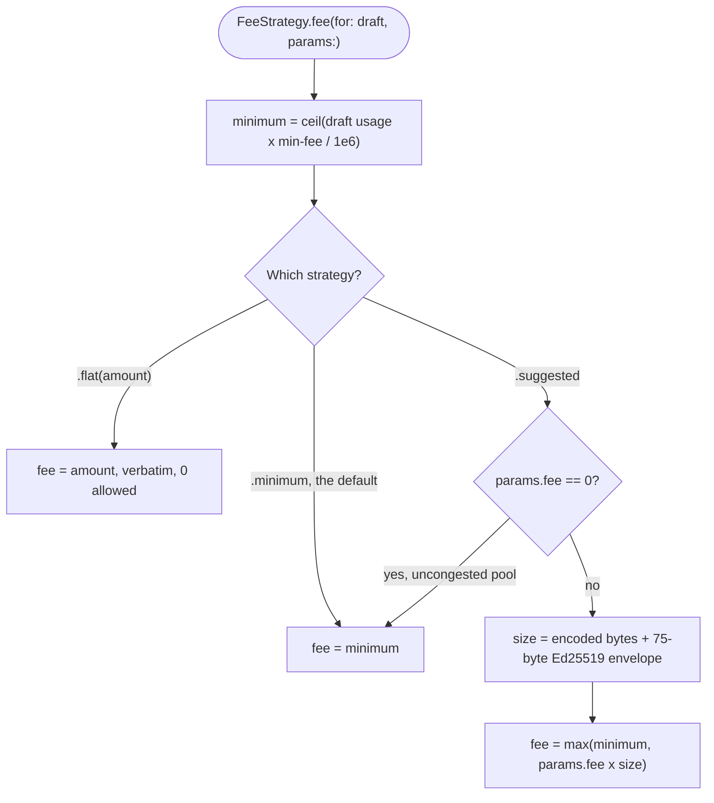

([`FeeStrategy.swift`](../Sources/Algorand/FeeStrategy.swift))

### 5.3 Response models

Every algod and indexer response is a `Codable & Sendable` struct with explicit kebab-case
`CodingKeys`. It is decoded by `JSONDecoder`, and fields that may be absent are optional, not
defaulted ([`AlgodClient.swift`](../Sources/Algorand/AlgodClient.swift),
[`IndexerClient.swift`](../Sources/Algorand/IndexerClient.swift)). Two deliberate gaps:

- `PendingTransaction` models only `confirmed-round`, `pool-error`, `asset-index` and
  `application-index`. It does not model the node's echo of your own signed transaction.
- `IndexerTransaction` decodes payment, asset-transfer and asset-config details only.
  **Unknown:** whether other transaction types' detail objects are planned. The code does not
  decode them.

On-chain state (balances, assets, applications, boxes) is always read from the node or indexer,
never cached.

## 6. Runtime and deployment

- **Packaging.** SwiftPM package `swift-algorand` with one library product, `Algorand`, and Swift
  tools 6.0. Declared platforms are iOS 15, macOS 11, tvOS 15, watchOS 8 and visionOS 1, plus
  Linux. CI builds and tests only macOS and Linux. The other Apple platforms are declared
  minimums that CI does not build ([`Package.swift`](../Package.swift),
  [`README.md`](../README.md)). **Unknown:** Windows. It is not declared or tested, and
  `SecureRandom` falls back to `/dev/urandom` off Apple platforms
  ([`SecureRandom.swift`](../Sources/Algorand/SecureRandom.swift)).
- **Dependencies.** `swift-crypto` 3.x is linked. `swift-docc-plugin` is used only at build time,
  for documentation.
- **Release.** Consumers pin git tags through SwiftPM, for example `.upToNextMinor(from: "0.4.0")`.
  Tags are unprefixed (`0.4.0`), and release notes live in [`CHANGELOG.md`](../CHANGELOG.md).
  There are no binaries.
- **Runtime.** Inside a caller's process only. Each client owns one `URLSession` (30 s
  per-request and 60 s per-resource timeouts by default, and `waitsForConnectivity = false` on
  Apple platforms). The session is invalidated in `deinit`.

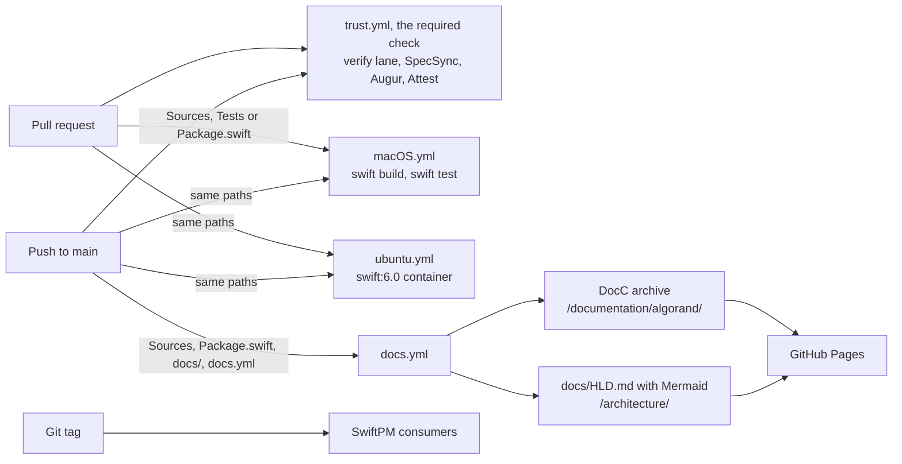

- **Verify lane.** `fledge lanes run verify` runs `swift build` and then `CI=true swift test`
  ([`fledge.toml`](../fledge.toml)). With `CI` set, the LocalNet integration suites skip.
- **Trust gate.** [`.trust.toml`](../.trust.toml) runs that lane as the lifecycle step. It also
  requires 100% SpecSync contract coverage, blocks on an Augur risk verdict of `block`
  ([`.augur.toml`](../.augur.toml)), and checks Attest provenance in soft mode
  ([`.attest.json`](../.attest.json)). The workflow is
  [`.github/workflows/trust.yml`](../.github/workflows/trust.yml).
- **Pages.** [`.github/workflows/docs.yml`](../.github/workflows/docs.yml) builds the DocC static
  archive with `--hosting-base-path swift-algorand`. It then renders this file to a sibling page
  with [`scripts/render-hld.ts`](../scripts/render-hld.ts), which uses Bun's built-in Markdown
  renderer and loads Mermaid from jsDelivr in the browser. It deploys both with
  `actions/deploy-pages`. The site is
  <https://corvidlabs.github.io/swift-algorand/>, and this document is at
  <https://corvidlabs.github.io/swift-algorand/architecture/>.
- **Tests.** Tests are offline by default. XCTest suites cover the original surface, and newer
  suites use Swift Testing. The algod transport tests stub `URLProtocol` through an internal
  `AlgodClient` initializer. LocalNet integration tests run only when `CI` is unset and
  `ALGORAND_NETWORK` is `localnet` (the default). They use
  [`scripts/start-localnet.sh`](../scripts/start-localnet.sh) and Docker
  ([`documentation/TESTING.md`](../documentation/TESTING.md)). The suite never sends to TestNet
  or MainNet.

## 7. Security and trust boundaries

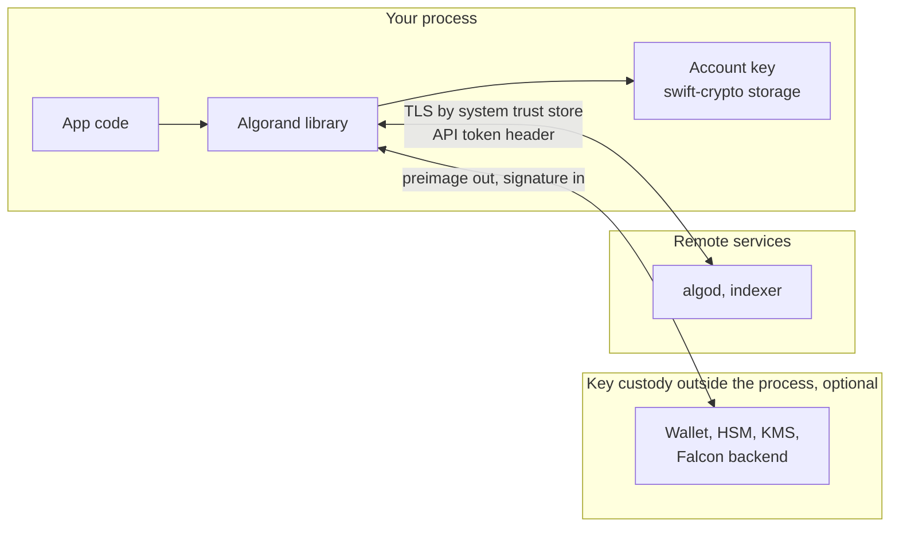

- **Keys.** `Account` holds its seed as a `Curve25519.Signing.PrivateKey` inside a private
  reference box, never as `Data`. Only `mnemonic()` turns the seed into bytes. In-memory clearing
  is explicitly **not** a security boundary ([`Account.swift`](../Sources/Algorand/Account.swift),
  [`SECURITY.md`](../SECURITY.md)).
- **Randomness.** `Account()` draws from swift-crypto's key generator. `Mnemonic.generate()`
  uses `SecRandomCopyBytes` on Apple platforms and `/dev/urandom` elsewhere
  ([`SecureRandom.swift`](../Sources/Algorand/SecureRandom.swift)).
- **External custody.** `TransactionSigner` and `bytesToSign(groupID:)` let a caller keep keys
  outside the process. The SDK never sees them. `PQSigner` is a `@Sendable` async callback
  ([`TransactionSigner.swift`](../Sources/Algorand/TransactionSigner.swift)).
- **What is validated locally.**
  - Canonical addresses and mnemonics.
  - An explicit `authAddr` must equal the signer.
  - Post-quantum proof shape and derived authorizer, checked at sign time and again at encode
    time.
  - Group size, the `apfa` limit and fee sufficiency (`checkFees`).
  - Base URLs must be absolute http(s) with a host
    ([`EndpointURL.swift`](../Sources/Algorand/EndpointURL.swift)).
- **What is not validated locally.**
  - Ed25519 signature bytes are carried verbatim.
  - Response bodies are trusted as the node reports them.
  - The node's combined reference cap (accounts, apps, assets and boxes) is not enforced
    ([`ApplicationTransaction.swift`](../Sources/Algorand/ApplicationTransaction.swift)).
  - There is no certificate pinning. The clients use the system trust store, and `http` is
    accepted, which LocalNet needs ([`SECURITY.md`](../SECURITY.md)).
- **Secrets in transit.** API tokens go in the `X-Algo-API-Token` and `X-Indexer-API-Token`
  headers only. The SDK logs nothing.
- **Audit status.** There has been no third-party security audit ([`SECURITY.md`](../SECURITY.md)).
  Vulnerabilities are reported through GitHub private vulnerability reporting.

## 8. Failure modes and limits

| Failure | What the caller sees | Source |
|---|---|---|
| Bad address or mnemonic, including non-canonical ones | `AlgorandError.invalidAddress` / `.invalidMnemonic` | [`Address.swift`](../Sources/Algorand/Address.swift), [`Mnemonic.swift`](../Sources/Algorand/Mnemonic.swift) |
| Missing builder field, empty group or more than 16 members, validity window past `UInt64`, box reference needing a ninth `apfa` slot | `AlgorandError.invalidTransaction` | transaction files, [`AtomicTransactionGroup.swift`](../Sources/Algorand/AtomicTransactionGroup.swift) |
| Map too large, or a key or signing backend failure | `AlgorandError.encodingError` | [`MessagePackWriter.swift`](../Sources/Algorand/MessagePackWriter.swift), [`Account.swift`](../Sources/Algorand/Account.swift) |
| `authAddr` is not the signer, or the post-quantum proof derives a different address or has bad sizes | `TransactionAuthorizationError` | [`TransactionAuthorization.swift`](../Sources/Algorand/TransactionAuthorization.swift) |
| Fee arithmetic overflow, or a group that underpays | `FeeError.overflow` / `.insufficient(required:paid:)` | [`FeeError.swift`](../Sources/Algorand/FeeError.swift) |
| Checked amount overflow, division by zero, NaN or negative `Double` | `AmountError` | [`AmountError.swift`](../Sources/Algorand/AmountError.swift) |
| Base URL that is not absolute http(s) | `AlgorandError.invalidURL` | [`EndpointURL.swift`](../Sources/Algorand/EndpointURL.swift) |
| Non-2xx HTTP status, including 429 | `AlgorandError.apiError(statusCode:message:)` with the body text | both clients |
| Transport failure (DNS, TLS, timeout) | The `URLSession` error, rethrown unwrapped | both clients |
| JSON that does not match a model | Swift `DecodingError`, rethrown unwrapped. `TransactionParams` throws `AlgorandError.decodingError` for a bad genesis hash. | both clients, [`Transaction.swift`](../Sources/Algorand/Transaction.swift) |
| Pool error or no confirmation within `timeout` rounds | `AlgorandError.networkError` | [`AlgodClient.swift`](../Sources/Algorand/AlgodClient.swift) |

Limits and behaviors to plan around:

- **No retries or backoff.** Every request is a single attempt. The only loop is
  `waitForConfirmation`, which polls once per round, 10 rounds by default. Rate limiting is left
  to the caller: a 429 is just an `apiError`.
- **Timeouts.** The defaults are 30 s per request and 60 s per resource. Both are configurable at
  client init. A slow node fails its own request, and a shared session cannot starve it.
- **Protocol sizes.** Up to 16 transactions per group and 8 foreign applications. The envelope
  fits a fixmap of at most 15 keys. A Falcon-1024 public key is 1793 bytes and a signature at most
  1538 bytes.
- **Fee defaults.** Header-field initializers default to 1000 microAlgos with no usage surcharge.
  A note longer than 1024 bytes built that way underpays. Params-based construction prices it
  correctly.
- **Traps that remain.** The deprecated `MicroAlgos` operators, `init(algos:)` and
  `AssetParams.toBaseUnits` still trap on bad input by design. The checked forms throw.
- **URL assembly inconsistency.** When `URLComponents` fails, `searchAccounts` throws
  `invalidURL`, but `searchTransactions`, `searchAssets` and `searchApplications` throw
  `networkError` ([`IndexerClient.swift`](../Sources/Algorand/IndexerClient.swift)).
  **Unknown:** whether this is intended.

## 9. Decisions

The living contract is [`specs/algorand/algorand.spec.md`](../specs/algorand/algorand.spec.md),
with its [requirements](../specs/algorand/requirements.md) and
[design context](../specs/algorand/context.md). Each merged change keeps its own design record
under [`.specsync/archive/changes/`](../.specsync/archive/changes/). The decisions with the most
reach:

1. **go-algorand is the byte authority.** Encoding follows go-algorand v5.0.1-stable's msgp
   output. Where py-algorand-sdk differs (`apan`, `nonpart`, `lx`), it is not authoritative
   ([`context.md`](../specs/algorand/context.md)).
2. **One omit-empty choke point.** Every field goes through `CanonicalTransactionFields`, so a
   new transaction type cannot reintroduce the zero-value bug that once broke every type at once
   (spec invariant 6).
3. **The same bytes are signed, submitted and hashed.** The envelope splices the already-encoded
   transaction, and the ID is the hash of the preimage (invariants 7 and 8).
4. **No bundled Falcon.** Post-quantum signing is a callback, as in the official Python and
   JavaScript SDKs. The SDK derives the address, builds the envelope and checks the proof
   (invariant 9).
5. **Fees are exact and never saturate.** The v42 usage model is implemented as the network
   computes it, and every overflow throws (invariant 10).
6. **Only canonical input is accepted.** Addresses and mnemonics are accepted only in the form
   every other Algorand tool accepts (invariant 11).
7. **Small public surface.** `MessagePackWriter`, `MessagePackValue` and `SHA512_256` are
   internal. They are the wire format of one chain, not general APIs (invariant 13).
8. **One session per client with real timeouts**, so the clients never share `URLSession.shared`
   ([`AlgodClient.swift`](../Sources/Algorand/AlgodClient.swift)).
9. **Live network checks stay out of the blocking PR lane**, and new test suites use Swift Testing
   because of an XCTest deadlock on Linux ([`context.md`](../specs/algorand/context.md)).
10. **DocC Pages stay outside Trust-managed Atlas** ([`.trust.toml`](../.trust.toml)).

## 10. Glossary

| Term | Meaning |
|---|---|
| algod | The Algorand node daemon and its REST API. It serves submission, status, pending transactions, simulation and account and app state. |
| Indexer | A separate service that serves searchable chain history from a database. |
| microAlgo | 1/1,000,000 of an ALGO. `MicroAlgos` wraps a `UInt64` count. |
| Round | A block height. `firstValid` and `lastValid` bound when a transaction may be confirmed. |
| Suggested params | `GET /v2/transactions/params`: `min-fee`, per-byte `fee`, genesis ID and hash, and last round. |
| Usage | Consensus v42's fee unit: `1_000_000` equals one minimum fee. |
| Atomic group | Up to 16 transactions that all succeed or all fail, bound by a shared `grp` group ID. |
| Rekey / `sgnr` | An account whose spending key was moved to another address. The envelope names that address as `sgnr`. |
| `pqsig` | The consensus v42 post-quantum proof: scheme, salt, public key and signature. |
| Falcon-1024 / `det1024` | The post-quantum signature scheme enabled in v42, tag `"f1"`, used with Algorand's deterministic signing profile. |
| Canonical MessagePack | go-algorand's encoding: sorted keys, smallest headers, and Go zero values omitted (`omitempty`). |
| `apfa` / box reference | An application call's foreign-app array, and a reference to an app's box storage by slot in that array. |
| LocalNet | A private Algorand network run in Docker for tests ([`docker-compose.yml`](../docker-compose.yml)). |
